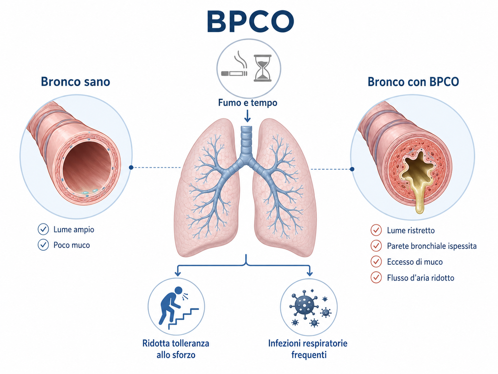
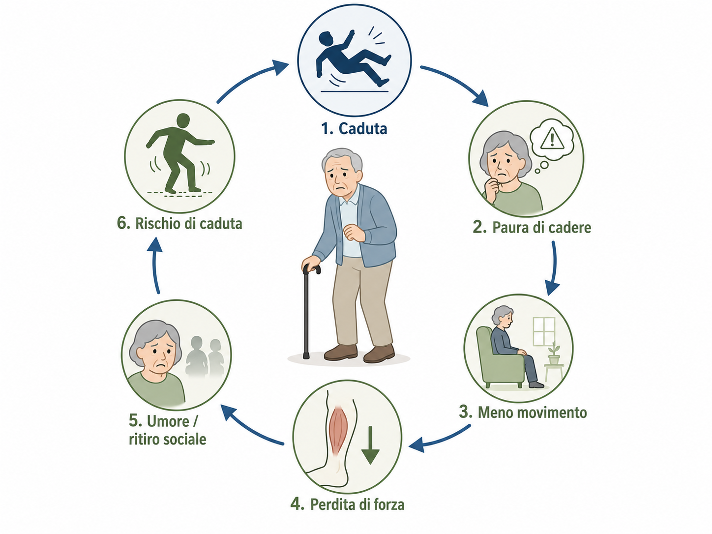
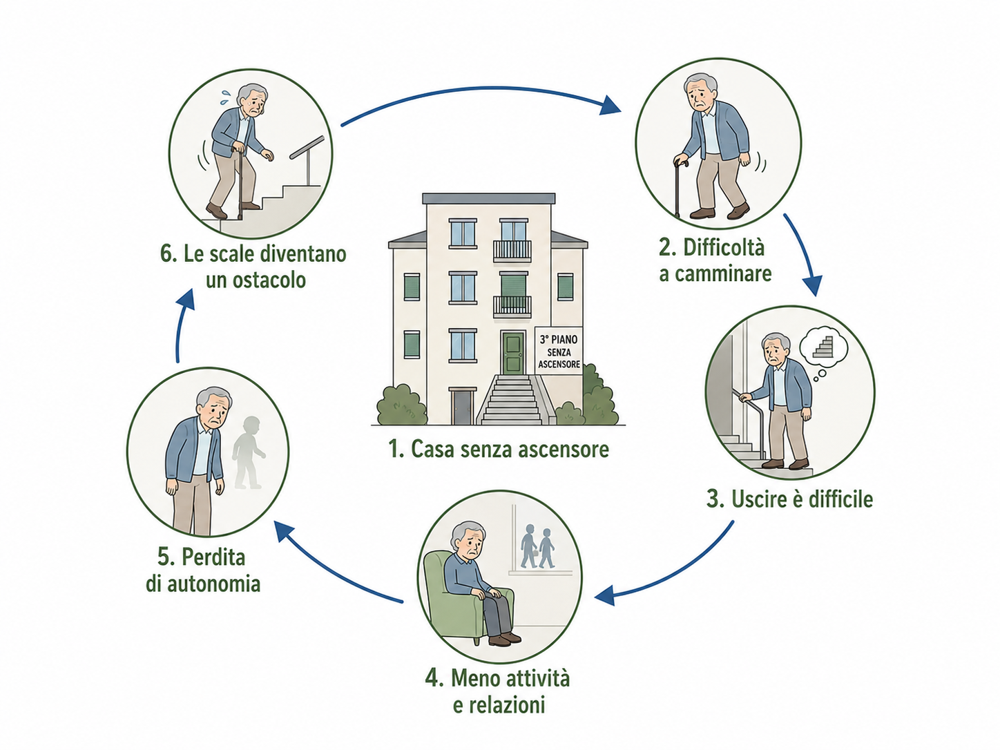
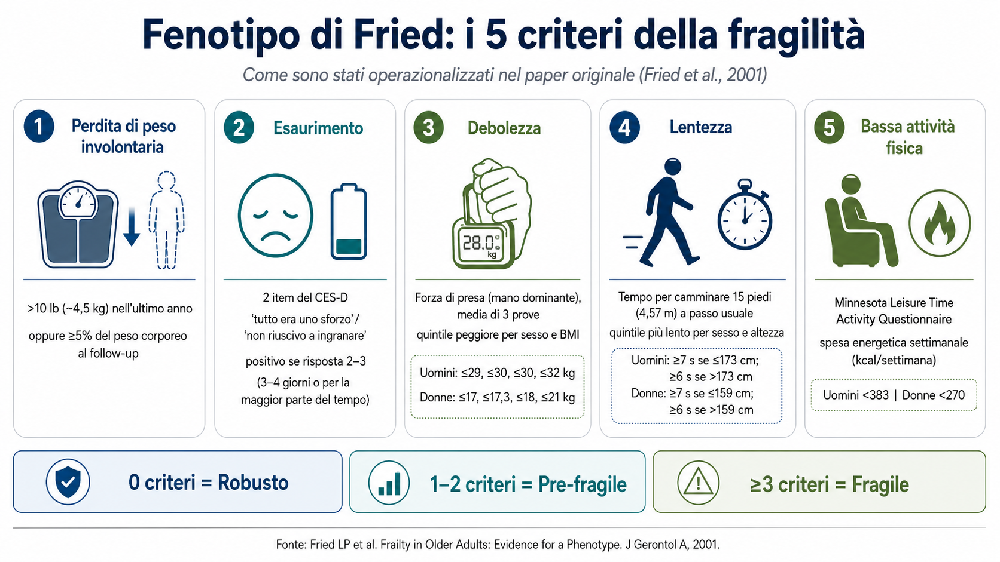
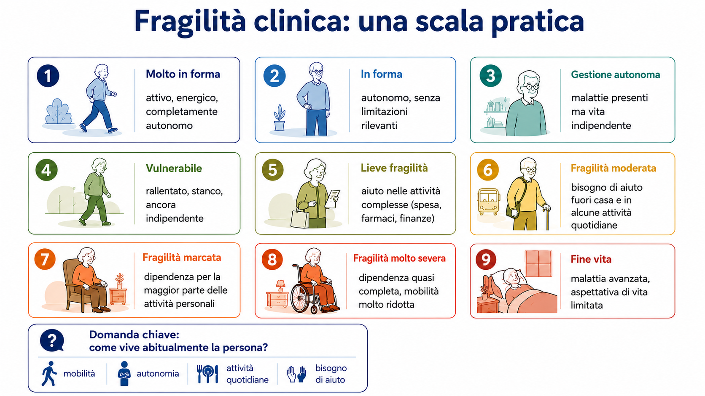
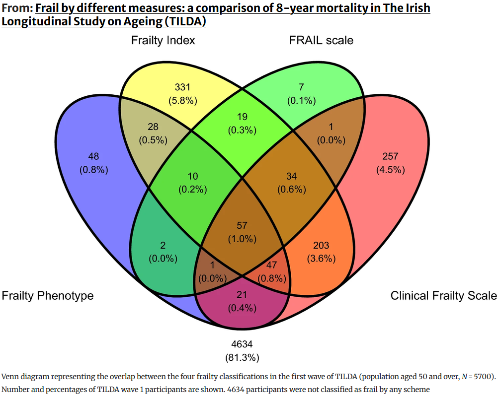

## Invecchiamento

Pensate a una persona anziana.

Pensate a una o due caratteristiche che la definiscono.

- A quale categoria appartengono queste caratteristiche?
  - Corpo / fisico
  - Cervello / cognizione
  - Psiche / benessere mentale
  - Socio-relazionale-economica
  - Clinica / malattie
  - Altro

## Invecchiamento

### L'età è solo una parte...

L'*età cronologica* rimane

- uno dei principali fattori di rischio non modificabili per malattia e morte

::: {.fragment}
### MA
:::

- è uguale per tutti
- non differenzia i bisogni

## Il modello {.smaller}

La lente utilizzata per guardare l'invecchiamento è il modello

### bio-psico-sociale {style="text-align: center;"}

:::: {.columns}

::: {.column width="33.3%"}

**Biologico**

- Cellule, tessuti e organi cambiano con il tempo
- Il danno può accumularsi e favorire malattia
- La malattia può contribuire a perdita di funzione e disabilità

:::

::: {.column width="33.3%"}

**Psicologico**

- L'invecchiamento modifica la percezione di sé e del mondo
- La percezione di sé e del mondo può modificare il modo di invecchiare

:::

::: {.column width="33.3%"}

**Sociale**

- L'invecchiamento modifica famiglia, lavoro, relazioni e società
- Ambiente e società influenzano a loro volta il modo di invecchiare

:::

::::

## Visione biologica {.smaller}

:::: {.columns}

::: {.column width="55%"}

- Il tempo e il fumo danneggiano vie aeree e tessuto polmonare
- Si sviluppano infiammazione cronica, alterazione delle secrezioni e rimodellamento
- Il flusso dell'aria diventa progressivamente più ostacolato
- Si instaura la **broncopneumopatia cronica ostruttiva (BPCO)**
- Una persona con BPCO può avere **dispnea e ridotta tolleranza allo sforzo**
- Può inoltre sviluppare **riacutizzazioni** e complicanze respiratorie

:::

::: {.column width="45%"}

{width="100%"}

:::

::::

## Visione psicologica {.smaller}

:::: {.columns}

::: {.column width="45%"}

- Una persona che cade può sviluppare **paura di cadere**
- Per paura di cadere si muove meno
- La minore attività favorisce **perdita di forza**
- Possono comparire **riduzione del tono dell'umore** e ritiro sociale
- La persona si muove ancora meno
- Il **rischio di una nuova caduta aumenta**

:::

::: {.column width="55%"}

{width="100%"}

:::

::::

## Visione sociale {.smaller}

:::: {.columns}

::: {.column width="40%"}

- Una persona anziana vive al **terzo piano senza ascensore**
- Se cammina con difficoltà, **uscire di casa diventa difficile**
- Si riducono **movimento, attività e relazioni**
- Aumentano **dipendenza** e perdita di autonomia
- Le scale diventano un ostacolo sempre maggiore

:::

::: {.column width="60%"}

{width="100%"}

:::

::::

## Attività {.smaller}

Immagina una persona anziana con **scompenso cardiaco**.

Lo scompenso può causare *mancafiato*, *stanchezza* e
*ridotta tolleranza all'esercizio*.

### Fai emergere una piccola rete bio-psico-sociale

Identifica almeno:

- un elemento **biologico**
- un elemento **psicologico**
- un elemento **sociale**

::: {.fragment}

**Poi, in gruppo:**

- collegate gli elementi con almeno **due frecce**
- per ogni freccia spiegate **come un elemento può influenzare l'altro**
- cercate almeno una relazione che **torni indietro**, creando un circolo

:::

::: {.notes}
5 minuti di lavoro individuale.

10–15 minuti di lavoro in gruppo.

5–10 minuti di restituzione e discussione.
:::

## PAUSA

### 10 minuti... {style="text-align: center;"}

## La fragilità

### Osservazione empirica

Alcune persone hanno conseguenze molto più gravi di altre davanti allo **stesso evento stressante**.

## La fragilità

### Uno stesso stressor: un'infezione

:::: {.columns}

::: {.column width="50%"}

**Persona robusta**

- Modesto impatto funzionale
- Buona tolleranza allo stressor
- Recupero relativamente rapido
- Ritorno alle attività abituali

:::

::: {.column width="50%"}

**Persona fragile**

- Importante perdita funzionale
- Maggiore rischio di complicanze
- Possibile delirium o immobilità
- Recupero più lento o incompleto

:::

::::

## La fragilità

### *Uno stato di aumentata vulnerabilità agli stressor, legato alla riduzione delle riserve e della capacità di mantenere o recuperare l'omeostasi* {style="text-align: center;"}

- Uno stressor può produrre conseguenze sproporzionate
- Il rischio di complicanze, eventi avversi e outcome negativi aumenta

## I problemi

1. **Standardizzare** la misura e la definizione nella pratica
2. Evitare che la fragilità diventi un **criterio automatico di esclusione**

## Standardizzare la misura

La fragilità descrive un *rischio*.

### Come possiamo misurarla?

- Sono stati proposti numerosissimi strumenti
- Al di là dello strumento:
  - è importante conoscere **popolazione e validazione**
  - è importante soprattutto *pensare* alla fragilità

## Frailty Index

**Intuizione:**

- considero numerosi *problemi di salute* (= **deficit**)
- attribuisco a ciascun deficit un valore tra **0 e 1**
- sommo il danno accumulato
- standardizzo sul numero di deficit considerati

### FI = deficit accumulati / deficit valutati

## Frailty Index — esempio

<iframe
  src="https://frailty-index-geriatria.netlify.app/"
  width="100%"
  height="590"
  style="border: none;"
  allowfullscreen>
</iframe>

## Fenotipo di fragilità

**Modello teorico:**

Quali sono le caratteristiche *manifeste* della fragilità?

{width="88%" style="display:block; margin:auto;"}

## Clinical Frailty Scale (CFS)

**Applicazione pratica**

{width="88%" style="display:block; margin:auto;"}

## Dicono la stessa cosa?

{width="62%" style="display:block; margin:auto;"}

## Attività {.smaller}

Considerate i tre strumenti per valutare la fragilità:

- **FI** — accumulo di deficit
- **FP** — cinque criteri fenotipici
- **CFS** — giudizio clinico gerarchico su funzione e dipendenza

::: {.fragment}

### In gruppo, ordinate i tre strumenti in base a:

- Facilità di utilizzo in una struttura **residenziale**
- **Obiettività**
- Facilità di comunicare il risultato al **caregiver**

Per ogni graduatoria, motivate almeno la prima e l'ultima posizione.

:::

::: {.notes}
Circa 8 minuti di discussione in gruppo.

7–10 minuti di restituzione.

Non è necessario cercare una graduatoria "corretta": il punto è rendere espliciti vantaggi, limiti e contesto d'uso.
:::

## Escludere sulla base della fragilità

Molti strumenti di fragilità hanno dimostrato **capacità prognostica**.

Questo significa che:

1. è importante riconoscere la fragilità, non soltanto scegliere una specifica scala
2. una persona più fragile presenta mediamente un rischio maggiore di eventi avversi e morte

::: {.fragment}

### Predire il rischio non significa decidere automaticamente il trattamento.

:::

## Esempio

Una persona di 78 anni, **CFS 7**, ha una neoplasia.

È disponibile un trattamento oncologico con possibili benefici, ma anche con importanti effetti avversi.

L'oncologo decide di non proporlo **sulla sola base della fragilità**.

### Qual è il problema di questo approccio?

## La cura centrata sulla persona

Può essere condivisibile non iniziare uno specifico trattamento, ma rimangono molte possibilità:

- proporre un approccio simultaneo-palliativo
- proporre supporto psicologico
- educare sulla possibile evoluzione della malattia e sulle complicanze
- attivare servizi alla persona: SAD, ADI, IFeC, UCpDOM
- revisionare la terapia
- discutere **priorità e obiettivi della persona**
- ...

## Attività finale {.smaller}

### Stessa età. Stessa malattia. Stessa persona?

:::: {.columns}

::: {.column width="50%"}

### Mario, 82 anni

Ha uno **scompenso cardiaco**.

::: {.nonincremental}

- vive solo
- fa la spesa e cucina autonomamente
- esce ogni giorno
- gestisce farmaci e appuntamenti
- dopo un'infezione respiratoria torna rapidamente alle attività abituali

:::

:::

::: {.column width="50%"}

### Giovanni, 82 anni

Ha uno **scompenso cardiaco**.

::: {.nonincremental}

- vive con la moglie
- necessita di aiuto per spesa e farmaci
- esce raramente
- cammina lentamente e si affatica facilmente
- dopo un'infezione respiratoria perde autonomia per diverse settimane

:::

:::

::::

## Attività finale

### In gruppo

1. Che cosa rende diverse queste due persone?
2. Chi vi sembra più fragile? **Perché?**
3. Quali altre informazioni vorreste conoscere?

::: {.notes}
5 minuti di riflessione individuale o a coppie.

10 minuti di discussione in gruppo.

10 minuti di restituzione.

Durante il debrief raccogliere: mobilità, ADL/IADL, cognizione, umore, nutrizione, farmaci, rete sociale, abitazione, obiettivi della persona.

Questo prepara naturalmente la lezione sulla Valutazione Multidimensionale Geriatrica.
:::

## Fragilità come porta

La valutazione della fragilità diventa un modo per

### identificare le persone anziane che più probabilmente hanno bisogni di salute complessi

::: {.fragment}

*Non serve a decidere chi curare.*
:::

 

[alberto.zucchelli@unibs.it](mailto:alberto.zucchelli@unibs.it)