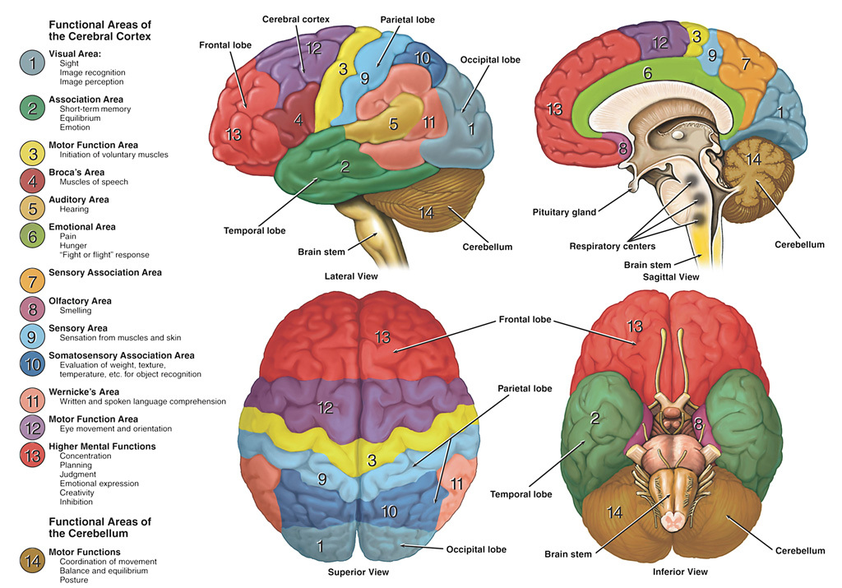

## Di cosa parliamo

1. **Che cosa sono le funzioni cognitive**
2. **Come dipendono dal cervello e dalle sue reti**
3. **Quando un cambiamento cognitivo diventa una sindrome clinica**

::: {.notes}
Presentare brevemente il percorso della lezione: prima un modello semplice della cognizione e del funzionamento cerebrale, poi il rapporto tra deficit cognitivo e vita quotidiana, infine le principali sindromi e alcuni strumenti diagnostici e terapeutici.
:::

# Funzioni cognitive

## Che cosa sono le funzioni cognitive?

Processi che ci permettono di:

### ricevere → comprendere → ricordare → usare informazioni

e di **guidare il comportamento** nella vita quotidiana.

::: {.notes}
Esempi orali: riconoscere una persona, ricordare cosa abbiamo fatto ieri, comprendere una frase, orientarci, organizzare una spesa, usare un oggetto. Primo messaggio da fissare: cognizione non coincide con memoria.
:::

## La cognizione non è una sola funzione {.smaller}

:::: {.columns}

::: {.column width="50%"}
**Attenzione**  
seguire una conversazione in un ambiente rumoroso

**Funzioni esecutive**  
organizzare una spesa, pianificare, cambiare strategia

**Memoria e apprendimento**  
imparare nuove informazioni, ricordare un appuntamento
:::

::: {.column width="50%"}
**Linguaggio**  
trovare una parola, comprendere una frase

**Percezione e movimento**  
orientarsi, riconoscere un volto, usare un oggetto

**Cognizione sociale**  
comprendere emozioni, intenzioni e norme sociali
:::

::::

::: {.notes}
Questi sono i sei domini cognitivi utilizzati dal DSM-5-TR. Gli esempi servono a tradurre i domini in comportamenti osservabili. Sottolineare che non tutte le demenze iniziano con un deficit di memoria.
:::

## I domini cognitivi {.smaller}

| Dominio | Alcune funzioni | Esempio quotidiano |
|---|---|---|
| **Attenzione complessa** | sostenuta, selettiva, divisa; velocità di elaborazione | seguire una conversazione in un ambiente rumoroso |
| **Funzioni esecutive** | pianificazione, decisione, inibizione, flessibilità, memoria di lavoro | organizzare una spesa o cambiare strategia |
| **Apprendimento e memoria** | apprendere, ricordare eventi e conoscenze | ricordare cosa è successo ieri; sapere cos'è un oggetto |
| **Linguaggio** | produzione, denominazione, comprensione | trovare una parola o capire una frase |
| **Percettivo-motorio** | visuospaziale, riconoscimento, prassia | orientarsi, riconoscere un volto, usare un oggetto |
| **Cognizione sociale** | emozioni, intenzioni, norme sociali | capire che qualcuno è ironico o arrabbiato |

::: {.notes}
Slide di riferimento, non da memorizzare parola per parola. La classificazione segue il DSM-5-TR; le funzioni elencate traducono i domini in esempi osservabili. L'orientamento è clinicamente importante, ma non è un settimo dominio DSM autonomo: integra memoria, attenzione e rappresentazione spaziale.
:::

## Alcune parole che potreste incontrare {.smaller}

| Termine | Significato essenziale |
|---|---|
| **Memoria episodica** | eventi vissuti, collocati nel tempo e nello spazio |
| **Memoria semantica** | conoscenze, concetti e significati |
| **Memoria di lavoro** | mantenere e manipolare temporaneamente informazioni |
| **Prassia** | eseguire gesti e azioni apprese |
| **Gnosia** | riconoscere ciò che viene percepito |
| **Prosopagnosia** | difficoltà specifica nel riconoscere i volti |
| **Abilità visuospaziali** | elaborare posizione, distanza e relazioni nello spazio |

::: {.notes}
Evitare “memoria a breve termine”, espressione ambigua. Distinguere memoria di lavoro, apprendimento e richiamo recente. Prosopagnosia e prassia non sono domini DSM autonomi, ma manifestazioni dell'area percettivo-motoria.
:::

# Dal cervello alle funzioni

## Dove sono, grossolanamente?

{fig-alt="Schema didattico dell'anatomia cerebrale con lobi, corteccia prefrontale, ippocampo, cervelletto e tronco encefalico" width="90%"}

::: {.notes}
Schema volutamente semplificato per orientarsi anatomicamente. Non suggerisce una corrispondenza uno-a-uno tra area e funzione: le funzioni cognitive emergono da reti distribuite.
:::

## Sistemi diversi contribuiscono a funzioni diverse

:::: {.columns}

::: {.column width="50%"}
**Temporale mediale / ippocampo**  
apprendere nuovi ricordi

**Aree temporali**  
linguaggio e conoscenze semantiche
:::

::: {.column width="50%"}
**Aree frontali**  
pianificazione e controllo

**Aree parietali e occipitali**  
elaborazione visuospaziale
:::

::::

### Ma nessuna area “fa tutto” da sola.

::: {.notes}
1–2 minuti, senza trasformare la lezione in neuroanatomia. Dire “contribuisce maggiormente”, non “è la sede esclusiva”. Le funzioni complesse emergono dall'attività coordinata di più regioni.
:::

## Il cervello funziona attraverso reti

### Per riconoscere una persona dobbiamo:

**vedere il volto** → **riconoscerlo** → **associarlo a informazioni** → **recuperare il nome**

Una funzione può alterarsi perché:

- è danneggiata una regione;
- si interrompono i **collegamenti** tra regioni.

::: {.notes}
Usare questo esempio per superare l'idea “un punto del cervello = una funzione”. Il prodotto osservabile dipende da una rete. Questo prepara sia alle malattie neurodegenerative sia al danno vascolare e ai diversi fenotipi clinici.
:::

## Che cosa significa neurodegenerazione?

### Perdita progressiva della struttura e della funzione dei neuroni

**neurone funzionante** → **disfunzione** → **perdita di connessioni e neuroni**

Nel cervello adulto la sostituzione dei neuroni perduti è **insufficiente** a compensare il danno.

> Se si deteriora una rete, diventano meno efficienti le funzioni che quella rete sostiene.

::: {.notes}
Evitare l'affermazione assoluta “i neuroni non si rimpiazzano mai”. Il messaggio corretto e sufficiente è che la sostituzione non compensa una perdita neuronale patologica progressiva. Ricordare che non tutte le demenze sono esclusivamente neurodegenerative: il danno vascolare può causare o contribuire al quadro.
:::

## Reti diverse, segnali iniziali diversi

:::: {.columns}

::: {.column width="33%"}
**Reti della memoria**

difficoltà ad apprendere nuove informazioni
:::

::: {.column width="33%"}
**Reti frontali**

pianificazione o comportamento
:::

::: {.column width="34%"}
**Reti linguistiche**

produzione o comprensione delle parole
:::

::::

### “Demenza” non significa semplicemente “perdere la memoria”.

::: {.notes}
Slide di sintesi e passaggio alla sindrome clinica. Le diverse malattie coinvolgono reti differenti, soprattutto nelle fasi iniziali; con l'evoluzione il coinvolgimento tende ad ampliarsi.
:::

# Cognizione e funzionamento quotidiano

## Disturbo neurocognitivo: servono cognizione **e** funzione {.smaller}

|  | **DNC minore** | **DNC maggiore** |
|---|---|---|
| **Cognizione** | declino **modesto** in ≥1 dominio | declino **significativo** in ≥1 dominio |
| **Evidenza** | preoccupazione documentata + valutazione cognitiva | preoccupazione documentata + valutazione cognitiva |
| **Indipendenza** | **conservata** | **interferenza** con l'indipendenza |
| **Nella pratica** | più tempo, sforzo, strategie o adattamenti | aiuto necessario almeno nelle attività complesse |

::: {.notes}
Sintesi didattica dei criteri DSM-5-TR. “Preoccupazione documentata” può provenire dalla persona, da un informatore o dal clinico; la prestazione è preferibilmente documentata con test standardizzati o altra valutazione quantitativa. Il quadro non deve comparire esclusivamente nel delirium e non deve essere spiegato meglio da un altro disturbo mentale. DNC maggiore corrisponde in larga misura alla sindrome tradizionalmente chiamata demenza.
:::

## Perché dobbiamo valutare il funzionamento?

:::: {.columns}

::: {.column width="50%"}
### Attività complesse · IADL

- gestire farmaci e denaro;
- spesa e preparazione dei pasti;
- telefono e tecnologia;
- trasporti;
- organizzare la giornata.
:::

::: {.column width="50%"}
### Attività di base · BADL

- vestirsi;
- lavarsi;
- alimentarsi;
- usare il bagno;
- muoversi nella quotidianità.
:::

::::

> Dobbiamo stabilire **se e quanto il deficit cognitivo** interferisce con la vita quotidiana.

::: {.notes}
Parlare di funzionamento quotidiano o autonomia funzionale, non semplicemente di “funzione fisica”. Il criterio diagnostico riguarda la perdita di indipendenza dovuta al deficit cognitivo. Una limitazione motoria isolata non trasforma un DNC minore in maggiore. Le IADL complesse tendono a essere coinvolte prima delle BADL.
:::

## Mild Cognitive Impairment · MCI

### Un deficit cognitivo senza demenza

**declino rispetto a prima**  
+ **deficit cognitivo oggettivabile**  
+ **indipendenza sostanzialmente conservata**

La persona può essere più lenta, fare più fatica o usare strategie compensative.

### MCI e DNC minore sono concetti vicini, non sinonimi perfetti.

::: {.notes}
MCI nasce da un diverso framework rispetto al DNC minore del DSM, ma i costrutti sono largamente sovrapposti. Non ridurre MCI a un singolo punteggio: servono cambiamento rispetto al precedente funzionamento, evidenza oggettiva e conservazione sostanziale dell'indipendenza.
:::

## MCI non significa inevitabilmente demenza

:::: {.columns}

::: {.column width="33%"}
### ↗ Migliora

Alla rivalutazione non soddisfa più i criteri
:::

::: {.column width="33%"}
### → Rimane stabile

Il deficit persiste senza progressione evidente
:::

::: {.column width="34%"}
### ↘ Progredisce

Il declino aumenta e può compromettere l'indipendenza
:::

::::

### MCI è uno stato clinico, non un destino.

::: {.notes}
La reversione significa che alla valutazione successiva i criteri non sono più soddisfatti; non dimostra necessariamente la scomparsa di un processo neurodegenerativo. Possono contribuire variabilità della misurazione, depressione, farmaci, sonno, patologie acute, fattori sensoriali o altre condizioni modificabili. Non mostrare percentuali: variano molto tra campioni clinici e di popolazione.
:::

# Dal segnale alla valutazione

## Caso guida: Maria

**Maria, 78 anni.**

Da circa un anno dimentica alcuni appuntamenti.

Usa molti promemoria.

La figlia riferisce qualche errore recente nelle bollette.

### Che cosa possiamo concludere?

::: {.notes}
Chiedere agli studenti di identificare: possibile cambiamento cognitivo, compensazione con promemoria, possibile impatto su una IADL. Non chiedere ancora di scegliere tra MCI e demenza.
:::

## Maria: segnali di allarme, non una diagnosi

**Dimentica appuntamenti** → possibile cambiamento cognitivo

**Usa promemoria** → possibile compensazione

**Errori nelle bollette** → possibile impatto funzionale

Ma dobbiamo ancora capire:

**è un vero declino? · è oggettivabile? · compromette l'indipendenza? · qual è la causa?**

### “Ha problemi cognitivi” ≠ “ha una demenza”

::: {.notes}
Questo è il messaggio principale del caso. Non appiccicare un'etichetta sulla base di pochi segnali. Servono anamnesi ed eteroanamnesi, valutazione cognitiva e funzionale, esame clinico, ricerca di fattori contribuenti e follow-up.
:::

## Non tutto ciò che modifica la cognizione è demenza {.smaller}

| Ambito | Condizioni o fattori da considerare | Possibili effetti |
|---|---|---|
| **Psiche e umore** | depressione, ansia | concentrazione, attenzione, rallentamento, memoria |
| **Endocrino / metabolico** | ipotiroidismo; disnatriemie; ipo/iperglicemia; ipercalcemia; uremia; disfunzione epatica | rallentamento, alterazioni attentive/cognitive, possibile delirium |
| **Farmaci e sostanze** | benzodiazepine, anticolinergici, sedativi; consumo eccessivo di alcol | sedazione, attenzione, memoria, delirium |
| **Carenze nutrizionali** | vitamina B12; deficit di tiamina/B1 | deficit cognitivo; encefalopatia di Wernicke nel contesto appropriato |

> Possono **causare, mimare o aggravare** un disturbo cognitivo e possono coesistere con una neurodegenerazione.

::: {.notes}
Evitare il titolo “cause reversibili di demenza”: spesso sono fattori contribuenti o diagnosi alternative, non spiegazioni complete di una sindrome neurodegenerativa tipica. TSH e vitamina B12 rientrano negli accertamenti di base raccomandati, insieme a un pannello metabolico che può evidenziare disnatriemie, alterazioni glicemiche, ipercalcemia, uremia e disfunzione epatica. Queste condizioni sono più spesso fattori contribuenti o cause di peggioramento acuto/subacuto che spiegazioni complete di una sindrome neurodegenerativa progressiva. Wernicke è legata a carenza di tiamina, soprattutto in malnutrizione, consumo problematico di alcol o malassorbimento; la triade classica può essere incompleta. Non usare “pseudodemenza” in modo semplicistico.
:::

## MMSE, MoCA e SPMSQ: test di screening {.smaller}

|  | **MMSE** | **MoCA** | **SPMSQ** |
|---|---|---|---|
| **Tipo** | screening breve | screening breve | screening molto breve |
| **Campiona** | orientamento, memoria, attenzione/calcolo, linguaggio, prassia | memoria, attenzione, esecutivo, visuospaziale, linguaggio, astrazione, orientamento | orientamento, memoria/conoscenze, calcolo semplice |
| **Punto di forza** | diffuso; impairment più evidente | più sensibile alle alterazioni lievi ed esecutive | rapido e semplice |
| **Limite** | meno sensibile a MCI/esecutivo | rimane uno screening | copertura cognitiva limitata |

::: {.notes}
Sono esempi di test brevi che campionano più domini in modo superficiale. Non sono equivalenti e non sostituiscono una valutazione neuropsicologica approfondita quando indicata. Lo SPMSQ è già noto agli studenti: usarlo come esempio di strumento rapido con copertura limitata.
:::

## Un test cognitivo non fa diagnosi di demenza

### test alterato → **approfondire**

### test normale ≠ **sicuramente normale**

Il risultato dipende anche da:

**età · scolarità · lingua e cultura · vista e udito · stato emotivo · condizioni acute**

> La diagnosi integra cognizione, funzionamento quotidiano, storia, clinica e andamento nel tempo.

::: {.notes}
Evitare l'equazione “MMSE sotto una soglia = demenza”. Un test positivo non identifica da solo né la sindrome né la causa; un risultato nei limiti non esclude deficit sottili o circoscritti. La valutazione breve serve a decidere se e come approfondire.
:::

# Principali sindromi

## Malattia di Alzheimer {.smaller}

:::: {.columns}

::: {.column width="50%"}
### Presentazione

**Esordio insidioso e progressivo**

Forma tipica:

- difficoltà ad apprendere e ricordare **nuove informazioni**;
- domande ripetute;
- appuntamenti e oggetti dimenticati;
- disorientamento.

Possibili anche esordi linguistici, visuospaziali o esecutivi.
:::

::: {.column width="50%"}
### Evoluzione

Progressivo coinvolgimento di più domini:

**memoria**  
→ linguaggio, orientamento, visuospaziale, esecutivo  
→ perdita delle IADL  
→ BADL e dipendenza crescente
:::

::::

> La presentazione amnestica è la più comune, ma Alzheimer non significa “solo memoria”.

::: {.notes}
Descrivere un pattern orientativo, non criteri diagnostici completi. La diagnosi eziologica richiede integrazione clinica e, quando indicato, imaging e biomarcatori. Il decorso varia tra persone e le copatologie sono frequenti.
:::

## Demenza a corpi di Lewy {.smaller}

:::: {.columns}

::: {.column width="50%"}
### Presentazione

Spesso precocemente:

- attenzione/esecutivo e visuopercezione;
- **fluttuazioni cognitive**;
- **allucinazioni visive** ricorrenti e ben strutturate;
- disturbo comportamentale del sonno REM;
- parkinsonismo spontaneo.

La memoria può essere meno compromessa all'inizio.
:::

::: {.column width="50%"}
### Evoluzione

Malattia progressiva con marcate **fluttuazioni**.

Nel tempo possono aumentare:

- deficit cognitivi e di memoria;
- parkinsonismo e cadute;
- disturbi autonomici e del sonno;
- sintomi neuropsichiatrici.
:::

::::

> Importante la possibile sensibilità grave agli antipsicotici.

::: {.notes}
Le quattro caratteristiche cliniche centrali sono fluttuazioni, allucinazioni visive, disturbo comportamentale del sonno REM e parkinsonismo. La sensibilità agli antipsicotici è una caratteristica di supporto e un punto di sicurezza clinica, non un invito agli studenti a gestire la terapia.
:::

## Demenza frontotemporale {.smaller}

:::: {.columns}

::: {.column width="50%"}
### Presentazione

**Comportamento / personalità · bvFTD**

disinibizione · apatia · perdita di empatia · rituali · alterazioni alimentari · deficit esecutivi

oppure

**Linguaggio · afasie primarie progressive**

produzione o comprensione progressivamente compromesse
:::

::: {.column width="50%"}
### Evoluzione

Il deficit inizialmente più circoscritto coinvolge progressivamente altre funzioni e compromette:

- relazioni;
- decisioni;
- attività quotidiane;
- autonomia.

In alcune forme compaiono disturbi motori.
:::

::::

> La memoria episodica può essere relativamente conservata nelle fasi iniziali.

::: {.notes}
Non ridurre la FTD alla sola disinibizione. Nella variante comportamentale sono centrali comportamento, personalità e funzioni esecutive; le sindromi linguistiche progressive costituiscono un'altra porta d'ingresso. La diagnosi differenziale psichiatrica può essere complessa.
:::

## Deterioramento cognitivo vascolare {.smaller}

:::: {.columns}

::: {.column width="50%"}
### Presentazione

**Molto eterogenea:** dipende da sede ed estensione del danno.

Frequenti:

- rallentamento cognitivo;
- deficit di attenzione;
- difficoltà esecutive e di pianificazione;
- deficit focali, apatia o alterazioni del cammino.

La memoria non deve predominare.
:::

::: {.column width="50%"}
### Evoluzione

**Ictus / infarto strategico**  
→ esordio relativamente brusco

**Eventi ripetuti**  
→ possibile andamento a gradini

**Malattia dei piccoli vasi**  
→ deterioramento anche lento e progressivo
:::

::::

> “Vascolare” descrive una causa, non un unico profilo clinico.

::: {.notes}
Smontare l'equazione “vascolare = sempre a gradini”. Il profilo dipende dal tipo, dalla sede e dall'estensione del danno cerebrovascolare. Il danno vascolare può essere causa primaria o contribuire a una sindrome mista.
:::

## Quattro pattern per orientarsi {.smaller}

| Sindrome | Segnale iniziale da ricordare | Decorso caratteristico |
|---|---|---|
| **Alzheimer** | nuove informazioni / memoria episodica | insidioso e progressivo |
| **Corpi di Lewy** | fluttuazioni + visuopercezione ± allucinazioni/parkinsonismo | progressivo, ma molto fluttuante |
| **Frontotemporale** | comportamento oppure linguaggio | ampliamento progressivo ad altre funzioni |
| **Vascolare** | esecutivo/rallentamento, ma variabile | brusco, a gradini o lentamente progressivo |

### Pattern utili per orientarsi, non scatole diagnostiche.

::: {.notes}
La sovrapposizione è comune, soprattutto nelle persone anziane. Le copatologie neurodegenerative e vascolari possono modificare presentazione ed evoluzione. Questa tabella serve a organizzare le informazioni, non a permettere una diagnosi per riconoscimento superficiale.
:::

## Farmaci sintomatici nella malattia di Alzheimer {.smaller}

| Farmaco | Come agisce | Rimborsabilità SSN in Italia · Nota 85 |
|---|---|---|
| **Donepezil** | inibisce l'acetilcolinesterasi → aumenta la disponibilità di acetilcolina | Alzheimer **lieve** (MMSE 21–26) e **moderato** (10–20) |
| **Rivastigmina** | inibisce acetil- e butirrilcolinesterasi → aumenta la trasmissione colinergica | Alzheimer **lieve** (21–26) e **moderato** (10–20) |
| **Memantina** | antagonista NMDA non competitivo → modula l'eccessiva trasmissione glutamatergica | Alzheimer **moderato** (10–20) e **severo** (<10) |

**Diagnosi e Piano Terapeutico dei CDCD** sono richiesti per la rimborsabilità SSN.

> Sono trattamenti **sintomatici**: possono produrre benefici modesti su cognizione e/o funzionamento, ma non arrestano la neurodegenerazione.

<small>Nota: la rivastigmina orale ha anche indicazione autorizzata nella demenza lieve–moderatamente severa associata a malattia di Parkinson idiopatica; questa indicazione non è quella disciplinata dalla Nota 85.</small>

<small>Fonti: AIFA Nota 85 e Piano Terapeutico, aggiornamento 05/03/2026; EMA, RCP/EPAR rivastigmina.</small>

::: {.notes}
Distinguere indicazione autorizzata da rimborsabilità SSN. La Nota 85 2026 riguarda la malattia di Alzheimer e richiede diagnosi e Piano Terapeutico dei CDCD. Donepezil e rivastigmina sono inibitori colinesterasici; memantina modula la trasmissione glutamatergica tramite recettori NMDA. Non presentare questi farmaci come disease-modifying.
:::

## Biomarcatori: utili in alcuni setting, non come screening {.smaller}

:::: {.columns}

::: {.column width="50%"}
### Già utilizzati in centri specialistici

- **Liquor:** Aβ42/40, p-tau, t-tau e rapporti
- **Amyloid PET**
- in casi selezionati, **tau PET**

Possono aumentare la certezza eziologica quando il risultato **cambia diagnosi, prognosi o gestione**.
:::

::: {.column width="50%"}
### Biomarcatori ematici: rapida evoluzione

- soprattutto **p-tau217**
- anche p-tau181 / p-tau231
- Aβ42/40 plasmatico

Test ad alte prestazioni possono essere usati come **triage** e, in setting specialistici selezionati, anche come test di conferma.
:::

::::

> **Non sono raccomandati come screening della popolazione cognitivamente normale.**

Un biomarcatore positivo documenta **biologia di Alzheimer**: non dimostra, da solo, che quella biologia spieghi tutti i sintomi della persona.

<small>Fonti: Alzheimer's Association CPG sui blood-based biomarkers, 2025; Revised Criteria for Diagnosis and Staging of Alzheimer's Disease, 2024.</small>

::: {.notes}
La linea guida Alzheimer's Association 2025 riguarda persone con impairment cognitivo oggettivo valutate in setting specialistici. I test ematici devono avere prestazioni validate e vanno interpretati dopo una valutazione clinica completa, considerando la probabilità pre-test. I criteri 2024 raccomandano di non eseguire test biomarcatori in persone cognitivamente integre fuori da studi di ricerca, in assenza di trattamenti approvati per la fase preclinica.
:::

# BPSD / sintomi neuropsichiatrici

## BPSD / sintomi neuropsichiatrici

**BPSD** = *Behavioural and Psychological Symptoms of Dementia*  
**NPS** = *Neuropsychiatric Symptoms*

Insieme eterogeneo di manifestazioni che possono riguardare:

**percezione · pensiero · umore · motivazione · comportamento · sonno · appetito**

### Non sono una diagnosi e non hanno una causa unica.

Possono emergere dall'interazione tra **malattia**, **stato fisico**, **persona** e **contesto**.

<small>Fonti: International Psychogeriatric Association; Linea guida italiana demenza/MCI, 2024.</small>

::: {.notes}
BPSD è un termine storico molto diffuso; NPS è frequente nella letteratura contemporanea. Il punto didattico è che “BPSD” non identifica una singola entità clinica: prima descriviamo ciò che accade, poi proviamo a comprenderlo.
:::

## Maria, cinque anni dopo

**Maria, 83 anni.**  
Malattia di Alzheimer in fase moderata. Vive in RSA da quattro mesi.

Nell'ultimo mese, quasi ogni giorno tra le **17 e le 19**:

- cammina ripetutamente nel corridoio;
- prova ad aprire la porta di uscita;
- dice: **«Devo andare a casa, i bambini mi aspettano.»**

Se qualcuno cerca di fermarla, a volte alza la voce e allontana la mano dell'operatore.

Alcune notti si alza, si veste e cerca di uscire dalla stanza.  
Al mattino è generalmente tranquilla e partecipa volentieri alle attività.

::: {.notes}
Il caso è volutamente descrittivo. Non nominare ancora agitazione, ansia, delirio, wandering o altri domini. La finestra “ultimo mese” permette di usare coerentemente l'NPI-Q.
:::

## Attività · usiamo il NPI-Q

### Aprite la scheda NPI-Q

**[NPI-Q · scheda completa, Alzheimer's Association](https://www.alz.org/media/documents/npiq-questionnaire.pdf)**

Sul caso di Maria:

1. individuate i domini per cui il caso fornisce **evidenza sufficiente**;
2. distingueteli da quelli per cui le informazioni sono **insufficienti**;
3. non cercate ancora di spiegare **perché** compaiono.

### 5 minuti

::: {.notes}
Non mostrare prima l'elenco dei domini. L'obiettivo è far usare realmente lo strumento. L'NPI-Q è compilato da un informatore e considera i sintomi nell'ultimo mese; per i domini presenti valuta anche severità e distress del caregiver. In questo caso non chiedere di forzare punteggi di severità/distress se le informazioni non sono disponibili.
:::

## NPI / NPI-Q: una mappa dei sintomi {.smaller}

:::: {.columns}

::: {.column width="33%"}
- deliri
- allucinazioni
- agitazione/aggressività
- depressione/disforia
:::

::: {.column width="33%"}
- ansia
- euforia
- apatia/indifferenza
- disinibizione
:::

::: {.column width="34%"}
- irritabilità/labilità
- comportamento motorio
- disturbi notturni
- appetito/alimentazione
:::

::::

**NPI-Q:** informatore · ultimi 30 giorni · presenza → severità + distress del caregiver.

> Il NPI **descrive e misura**. Non spiega la causa.

<small>Fonte: Kaufer et al., 2000; Alzheimer's Association DETeCD-ADRD instruments guideline.</small>

::: {.notes}
Debrief dell'attività. Riprendere le scelte degli studenti e discutere soprattutto le zone di incertezza. Una frase isolata non basta, ad esempio, per concludere automaticamente che sia presente un delirio.
:::

## Perché compaiono? Un modello multifattoriale

:::: {.columns}

::: {.column width="50%"}
### Cervello / malattia
- neurodegenerazione;
- deficit cognitivi;
- alterazioni percettive;
- ridotta capacità di autoregolazione.

### Corpo
- dolore;
- delirium;
- stipsi / ritenzione;
- fame, sete, sonno;
- farmaci e comorbilità.
:::

::: {.column width="50%"}
### Persona / biografia
- abitudini e ruoli;
- preferenze;
- storia di vita;
- modalità abituali di coping.

### Ambiente / interazioni
- rumore e sovrastimolazione;
- richieste troppo complesse;
- cambiamenti di routine;
- tono, fretta, confronto o correzione.
:::

::::

### Spesso più fattori agiscono contemporaneamente.

<small>Fonti: Kales et al., JAGS 2014; Linea guida italiana demenza/MCI, 2024; NICE NG97.</small>

::: {.notes}
È una cornice generale biopsicosociale. Non cercare una causa unica. La stessa manifestazione può emergere da combinazioni differenti di fattori nella stessa persona in momenti diversi.
:::

## Tre lenti per formulare ipotesi {.smaller}

| Lente | Domanda |
|---|---|
| **Unmet needs / NDB** | C'è un bisogno che la persona non riesce a esprimere o soddisfare? |
| **Progressively Lowered Stress Threshold · PLST** | Stimoli e richieste stanno superando la sua capacità di tollerarli? |
| **Analisi funzionale / comportamentale** | Esistono pattern tra ciò che accade prima, il comportamento e ciò che accade subito dopo? |

### Le lenti possono essere usate insieme.

<small>Fonti: Cohen-Mansfield, 2001; Whall & Kolanowski, 2004; Smith et al., 2004.</small>

::: {.notes}
La lente comportamentale deriva dall'analisi funzionale: non significa che il comportamento sia volontariamente “appreso” o manipolativo. Si osservano sequenze ripetute antecedente-comportamento-conseguenza per capire se alcuni contesti o risposte aumentano o riducono la probabilità che il comportamento si ripresenti. La conseguenza può, in alcuni casi, contribuire a mantenere un pattern, ma questa è un'ipotesi da verificare su più episodi, non una conclusione automatica.
:::

## Biografia e personhood: una lente trasversale

Il comportamento avviene nella storia di **quella persona**.

Conoscere:

**ruoli · relazioni · routine · lavoro · interessi · valori · esperienze significative**

può aiutarci a capire:

- perché una situazione acquista un certo significato;
- quali interazioni possono generare distress;
- quali attività possono risultare familiari e significative.

> La biografia non “spiega” automaticamente il comportamento: **rende migliori le nostre ipotesi**.

<small>Fonti: person-centred care, NICE NG97; Spector & Orrell, 2010.</small>

::: {.notes}
Richiamare il concetto di personhood senza trasformarlo in una quarta teoria causale dei BPSD. È una lente trasversale che modifica il modo in cui interpretiamo bisogni, stress e sequenze comportamentali.
:::

## *This is me*: quattro domande per conoscere la persona {.smaller}

| Domanda didattica | Che cosa cerchiamo |
|---|---|
| **Chi sono?** | storia, persone importanti, ruoli, lavoro, luoghi, cultura |
| **Come vivo la mia giornata?** | routine, orari, attività, preferenze, autonomia |
| **Come comunicare e aiutarmi?** | modalità di comunicazione, sensi, mobilità, supporto desiderato |
| **Cosa mi mette in difficoltà / cosa mi aiuta?** | situazioni che preoccupano o agitano; ciò che rassicura e fa stare meglio |

**[This is me · pagina ufficiale e scheda scaricabile, Alzheimer's Society](https://www.alzheimers.org.uk/get-support/publications-factsheets/this-is-me)**

<small>Sintesi didattica della scheda, non le sue sezioni ufficiali. Fonte: Alzheimer's Society, *This is me*, 4ª ed.; NICE NG97.</small>

::: {.notes}
La scheda ufficiale è più articolata: storia personale e background, routine, autonomia e aiuto desiderato, ciò che preoccupa e ciò che rassicura, comunicazione, mobilità, sonno, cura personale, farmaci, alimentazione. È uno strumento di comunicazione e continuità assistenziale, non un trattamento dei BPSD.
:::

## ABC: rendere osservabile un episodio

### A · Antecedent
**Che cosa accade prima?**

↓  

### B · Behaviour
**Che cosa fa o dice concretamente la persona?**

↓  

### C · Consequence
**Che cosa accade subito dopo?**

> Ripetere l'osservazione su più episodi permette di cercare **pattern**.

<small>Riferimento: functional analysis applicata ai comportamenti nella demenza.</small>

::: {.notes}
“Consequence” non significa punizione. È qualsiasi cosa succeda dopo: risposta dello staff, allontanamento da una situazione, maggiore attenzione, cambiamento dell'ambiente. ABC serve anzitutto a descrivere con precisione, riducendo interpretazioni premature.
:::

## DICE: organizzare il ragionamento

:::: {.columns}

::: {.column width="25%"}
### D
**Describe**

Che cosa succede?  
Quando? Quanto? Con chi?
:::

::: {.column width="25%"}
### I
**Investigate**

Corpo? Bisogni?  
Stress? Ambiente? Interazioni?
:::

::: {.column width="25%"}
### C
**Create**

Costruire un piano personalizzato.
:::

::: {.column width="25%"}
### E
**Evaluate**

Verificare e modificare il piano.
:::

::::

### Nel prossimo esercizio ci fermiamo a **Describe + Investigate**.

<small>Fonte: Kales, Gitlin, Lyketsos. J Am Geriatr Soc. 2014;62:762–769.</small>

::: {.notes}
ABC è particolarmente utile dentro Describe e per generare dati utili a Investigate. Le tre lenti teoriche aiutano a costruire ipotesi durante Investigate. Create ed Evaluate verranno affrontati dopo.
:::

## Attività · Maria: descrivere e formulare ipotesi

Riprendete il caso iniziale di Maria.

### 1. Descrivete ciò che osservate con **ABC**.

### 2. Fermatevi a **Investigate** del DICE:
formulate **2–3 ipotesi** usando le tre lenti.

**unmet needs · stress threshold · analisi funzionale/comportamentale**

### Non proponete ancora interventi.

::: {.notes}
8–10 minuti. La consegna deve restare volutamente breve. L'obiettivo è distinguere due operazioni: descrivere ciò che è osservabile e formulare ipotesi. Non chiedere soluzioni, outcome o ulteriori piani in questa fase.
:::

## Maria: nuove informazioni

Dalla figlia e dall'osservazione dello staff emerge che:

- per molti anni, verso le **17:30**, Maria lasciava il lavoro per occuparsi dei figli e preparare la cena;
- le piace ancora **apparecchiare** e **piegare la biancheria**;
- gli episodi sono più frequenti durante il **cambio turno**, quando il corridoio è rumoroso;
- tende a irritarsi quando viene corretta direttamente sui figli o sul fatto che ora viva in RSA.

La valutazione clinica non mostra delirium, dolore evidente o nuova malattia acuta.

### Quali ipotesi diventano più plausibili? Quali meno?

::: {.notes}
Debrief dell'attività. Ora si può mostrare il valore della biografia, del PLST e dell'analisi funzionale senza pretendere di avere identificato una “vera causa”. La valutazione clinica riduce ma non elimina completamente la possibilità di fattori fisici.
:::

## Investigate: prima di dire «è la demenza» {.smaller}

:::: {.columns}

::: {.column width="50%"}
### Persona / corpo
- dolore o discomfort;
- delirium / infezione / malattia acuta;
- stipsi, ritenzione, fame, sete;
- sonno;
- vista e udito;
- effetti o modifiche dei farmaci.
:::

::: {.column width="50%"}
### Contesto
- ambiente rumoroso o poco leggibile;
- sovra- o sottostimolazione;
- attività senza significato;
- compito troppo difficile;
- cambio di caregiver/routine;
- comunicazione, tono, fretta, confronto.
:::

::::

> **Un nuovo comportamento richiede una nuova valutazione.**

<small>Fonti: Linea guida italiana demenza/MCI 2024; NICE NG97.</small>

::: {.notes}
La linea guida italiana raccomanda una valutazione strutturata delle possibili cause del distress, compresi dolore, delirium e assistenza inappropriata, prima di scegliere il trattamento.
:::

## Create: cosa ha più supporto EBM? {.smaller}

### Principi con maggiore sostegno nelle linee guida

- **interventi psicosociali e ambientali** come approccio iniziale e continuativo;
- **attività personalizzate e significative** per agitazione/aggressività;
- adattare ambiente, richieste e comunicazione;
- correggere dolore, delirium e altri fattori clinici modificabili;
- formazione dello staff e coerenza del piano assistenziale.

### Interventi che si possono considerare in casi selezionati

**musicoterapia · giardini terapeutici · companion/therapeutic robots**

L'evidenza è meno robusta e l'effetto non è universale.

<small>Fonti: Linea guida italiana demenza/MCI 2024; NICE NG97.</small>

::: {.notes}
La linea guida italiana raccomanda attività personalizzate per promuovere engagement, piacere e interesse. Musicoterapia, giardini terapeutici e robot interattivi hanno raccomandazioni più deboli/“consider”.
:::

## Alcune strategie possibili {.smaller}

| Strategia | Come pensarla |
|---|---|
| **Attività ponte** | attività significativa legata a interessi/ruoli, proposta prima del momento critico; applicazione pratica delle *personalised activities* |
| **Distrazione / redirection** | spostare l'attenzione verso un'attività o stimolo accettabile, senza forzare |
| **Interazione gentile / validante** | tono calmo e non-confrontativo; riconoscere l'emozione prima di correggere i fatti |
| **Pet / animal-assisted therapy** | possibile attività gradita in persone selezionate; evidenza su agitazione/BPSD complessivi ancora incerta |

<small>Fonti: NICE NG97; Linea guida italiana 2024; revisioni sistematiche sugli interventi non farmacologici.</small>

::: {.notes}
“Attività ponte” non è una categoria terapeutica formalmente validata: è una traduzione operativa di attività personalizzata e significativa. Gentle care/validation/redirection sono componenti relazionali difficili da isolare come singoli trattamenti. L'evidenza sull'animal-assisted therapy per agitazione/BPSD rimane limitata.
:::

## Maria: un possibile piano

**Prima delle 17:00**
- verificare toilette, fame/sete, dolore/discomfort;
- ridurre per quanto possibile il rumore del cambio turno.

**17:15–18:00**
- proporre una **attività ponte** coerente con la sua biografia: apparecchiare, piegare biancheria, preparare qualcosa per la cena;
- se cerca l'uscita, accompagnarla e **reindirizzare** senza confronto fattuale.

**Comunicazione**
- evitare «i suoi figli sono adulti»;
- riconoscere l'emozione e proporre un'attività coerente.

### Ogni elemento del piano dovrebbe corrispondere a una ipotesi.

::: {.notes}
Questa non è la “soluzione corretta” del caso, ma un esempio di passaggio dalla formulazione a Create. Valutare sempre preferenze, sicurezza e risposta individuale.
:::

## Evaluate: decidere prima che cosa significa «funziona»

Possibili esiti:

- numero di episodi / settimana;
- durata;
- intensità del distress;
- necessità di intervento fisico dello staff;
- rischio per Maria o altri;
- partecipazione/gradimento dell'attività;
- distress del caregiver/staff.

### «Sembra più tranquilla» è un'impressione. Serve una misura ripetibile.

NPI-Q o strumenti specifici possono essere utili **se usati longitudinalmente nello stesso modo**.

<small>Fonti: Kales et al. DICE, 2014; Kaufer et al. NPI-Q, 2000.</small>

::: {.notes}
Definire un outcome osservabile prima dell'intervento riduce bias di conferma e permette di decidere se mantenere, modificare o interrompere il piano.
:::

## Antipsicotici: pochi casi, obiettivi chiari {.smaller}

### Non sono il trattamento standard dei BPSD.

Considerarli quando la persona:

- è a rischio di **danneggiare sé o altri**, oppure
- presenta **agitazione, allucinazioni o deliri con grave distress**.

Se utilizzati:

**dose minima efficace · tempo più breve possibile · rivalutazione almeno ogni 4 settimane**

- discutere benefici e rischi;
- interrompere se non c'è beneficio chiaro;
- cautela particolare in **DLB/PDD** per possibili gravi reazioni di sensibilità.

> Anche durante il trattamento farmacologico devono continuare gli interventi psicosociali e ambientali.

<small>Fonti: Linea guida italiana demenza/MCI 2024; NICE NG97.</small>

::: {.notes}
Beneficio medio modesto e rischi clinicamente rilevanti, inclusi eventi cerebrovascolari, sedazione, parkinsonismo e aumento della mortalità in popolazioni con demenza. Non entrare in schemi prescrittivi specifici in questa lezione.
:::

## Memantina e citalopram: non scorciatoie per l'agitazione {.smaller}

:::: {.columns}

::: {.column width="50%"}
### Memantina

Ha indicazione nel trattamento sintomatico dell'Alzheimer **moderato–severo**.

Può migliorare alcuni esiti comportamentali nel contesto del trattamento della malattia.

Ma un RCT dedicato all'**agitazione clinicamente significativa** non ha mostrato beneficio sull'endpoint primario.

### Non iniziarla semplicemente «per l'agitazione».
:::

::: {.column width="50%"}
### Citalopram

Nel trial **CitAD**, 30 mg/die + intervento psicosociale ha ridotto l'agitazione rispetto al placebo.

Ma ha anche prodotto:

- **peggioramento cognitivo**;
- **prolungamento del QT**.

Nei pazienti anziani la dose massima raccomandata è **20 mg/die**.

### Segnale di efficacia ≠ trattamento routinario.
:::

::::

<small>Fonti: Fox et al., PLoS One 2012; Porsteinsson et al., JAMA 2014; AIFA.</small>

::: {.notes}
Per memantina distinguere l'indicazione per Alzheimer dal trattamento specifico dell'agitazione. CitAD è importante perché mostra sia un segnale di efficacia sia un limite di trasferibilità: la dose di 30 mg/die è superiore alla dose massima oggi raccomandata negli anziani per il rischio QT.
:::

## BPSD: cosa portarsi a casa

### **NPI-Q** → classificare e misurare

### **ABC** → descrivere un episodio e cercare pattern

### **Tre lenti** → formulare ipotesi

### **DICE** → organizzare il percorso

### **Person-centred care** → conoscere la persona per costruire un piano coerente

> Classificare un comportamento non significa averlo compreso.

::: {.notes}
Chiudere tornando a Maria. Il passaggio fondamentale è separare classificazione, descrizione, formulazione di ipotesi e progettazione dell'intervento.
:::

## Dove siamo arrivati

Ora sappiamo:

- distinguere **funzioni cognitive**, deficit e perdita di indipendenza;
- orientarci tra le principali sindromi;
- interpretare screening, biomarcatori e trattamenti sintomatici;
- descrivere i **BPSD/NPS** senza confondere osservazione e spiegazione;
- usare **NPI, ABC e DICE** per passare dal comportamento a un piano;
- scegliere interventi personalizzati e **valutarne l'effetto**.

### La domanda non è solo «che comportamento è?», ma «che cosa può significare qui, per questa persona?»

::: {.notes}
Chiusura dell'intera bozza. Collegare la prima parte cognitiva alla seconda: la demenza modifica capacità cognitive e comunicative, ma il comportamento emerge sempre nell'interazione fra persona, corpo, malattia e contesto.
:::

## Fonti principali {.smaller}

- American Psychiatric Association. *DSM-5-TR*: domini e criteri dei disturbi neurocognitivi.
- Alzheimer's Association. DETeCD-ADRD Clinical Practice Guideline. *Alzheimer's & Dementia*. <https://doi.org/10.1002/alz.14333>
- Linea guida italiana su diagnosi e trattamento di demenza e MCI. *Age and Ageing*. <https://doi.org/10.1093/ageing/afae250>
- Jack CR Jr, et al. Revised criteria for diagnosis and staging of Alzheimer's disease. *Alzheimer's & Dementia*. <https://doi.org/10.1002/alz.13859>
- Palmqvist S, et al. Alzheimer's Association Clinical Practice Guideline on blood-based biomarkers in specialized care. *Alzheimer's & Dementia*. <https://pubmed.ncbi.nlm.nih.gov/40729527/>
- AIFA. Nota 85 e Piano Terapeutico per i farmaci per la malattia di Alzheimer, aggiornamento 05/03/2026. <https://www.aifa.gov.it/nota-85>
- EMA. Rivastigmine (Exelon): EPAR e informazioni di prodotto. <https://www.ema.europa.eu/en/medicines/human/EPAR/exelon>
- McKeith IG, et al. Diagnosis and management of dementia with Lewy bodies. *Neurology*. <https://doi.org/10.1212/WNL.0000000000004058>
- Rascovsky K, et al. Diagnostic criteria for behavioural variant FTD. *Brain*. <https://doi.org/10.1093/brain/awr179>
- Sachdev P, et al. VASCOG statement on vascular cognitive disorders. <https://doi.org/10.1097/WAD.0000000000000034>
- USPSTF. Cognitive impairment in older adults: screening. <https://www.uspreventiveservicestaskforce.org/uspstf/recommendation/cognitive-impairment-in-older-adults-screening>
- Kaufer DI, et al. Validation of the NPI-Q. *J Neuropsychiatry Clin Neurosci*. 2000;12:233–239. <https://doi.org/10.1176/jnp.12.2.233>
- NPI-Q · Alzheimer's Association: scheda completa. <https://www.alz.org/media/documents/npiq-questionnaire.pdf>
- Cohen-Mansfield J. Nonpharmacologic interventions for inappropriate behaviors in dementia: a review, summary, and critique. *Am J Geriatr Psychiatry*. 2001;9:361–381. <https://pubmed.ncbi.nlm.nih.gov/11739063/>
- Smith M, et al. History, development, and future of the progressively lowered stress threshold. *J Gerontol Nurs*. 2004;30:22–31. <https://pubmed.ncbi.nlm.nih.gov/15450057/>
- Spector A, Orrell M. Using a biopsychosocial model of dementia as a tool to guide clinical practice. *Int Psychogeriatr*. 2010;22:957–965. <https://doi.org/10.1017/S1041610210000840>
- Alzheimer's Society. *This is me*: support tool for person-centred care. <https://www.alzheimers.org.uk/get-support/publications-factsheets/this-is-me>
- *This is me* · Alzheimer's Society: pagina ufficiale e download della scheda. <https://www.alzheimers.org.uk/get-support/publications-factsheets/this-is-me>
- Kales HC, Gitlin LN, Lyketsos CG. Management of neuropsychiatric symptoms of dementia: the DICE approach. *J Am Geriatr Soc*. 2014;62:762–769. <https://doi.org/10.1111/jgs.12730>
- Whall AL, Kolanowski AM. Need-driven dementia-compromised behavior model. *Aging Ment Health*. 2004;8:106–108. <https://doi.org/10.1080/13607860410001649590>
- Song JA, et al. Need-Driven Dementia-Compromised Behavior model-based interventions: systematic review and meta-analysis. *Int J Nurs Stud*. 2026;176:105337. <https://doi.org/10.1016/j.ijnurstu.2026.105337>
- Moniz Cook ED, et al. Functional analysis-based interventions for challenging behaviour in dementia. *Cochrane Database Syst Rev*. 2012;CD006929. <https://doi.org/10.1002/14651858.CD006929.pub2>
- NICE. *Dementia: assessment, management and support for people living with dementia and their carers* (NG97). <https://www.nice.org.uk/guidance/ng97>
- Fox C, et al. Efficacy of memantine for agitation in Alzheimer's dementia. *PLoS One*. 2012;7:e35185. <https://doi.org/10.1371/journal.pone.0035185>
- Porsteinsson AP, et al. Effect of citalopram on agitation in Alzheimer disease: CitAD. *JAMA*. 2014;311:682–691. <https://doi.org/10.1001/jama.2014.93>
- AIFA. Citalopram: aggiornamento di sicurezza sul prolungamento del QT e dose massima negli anziani. <https://www.aifa.gov.it/>

::: {.notes}
Fonti di riferimento della bozza. Prima della versione definitiva si potrà aggiungere una bibliografia completa e uniforme. Il DSM-5-TR è la fonte nosografica per DNC minore/maggiore; le linee guida italiana e Alzheimer's Association sostengono il percorso diagnostico integrato e la valutazione cognitivo-funzionale.
:::
