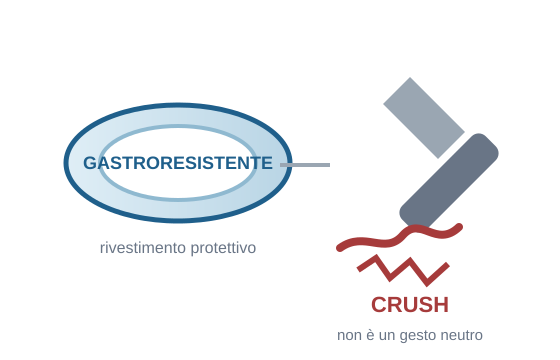

## Sfide e gestione della politerapia in RSA {.title-slide-custom}

SIGG Lombardia 2026

# Dal numero di farmaci all'appropriatezza della cura

Alberto Zucchelli

## La politerapia è la norma

  

    
7,7

    
farmaci / residente

  

  

    
84,8%

    
≥ 5 farmaci

  

  

    
24,0%

    
≥ 10 farmaci

  

  <strong>Prescription Day LTCFs 2024</strong>
  3.400 residenti
  82 strutture
  età media 84,7 anni

Malara et al. Aging Clin Exp Res. 2025;37:291.

## 7,7 farmaci. Ma in chi?

  
49,7%<b>fragilità severa</b>

  
48,2%<b>demenza</b>

  
96,2%<b>≥1 ADL compromessa</b>

  
15,5%<b>disfagia</b>

  POLYPHARMACY
  ≠
  INAPPROPRIATE POLYPHARMACY

La domanda non è “quanti?”, ma <strong>“appropriati per chi, e per quale obiettivo?”</strong>

Malara et al. Aging Clin Exp Res. 2025;37:291.

## Il rischio è nella complessità

42,2%<small>≥1 DDI potenzialmente clinicamente rilevante</small>

≥3 farmaci CNS-active
<i style="width:78%"></i>
<b>33,2%</b>

≥2 anticolinergici
<i style="width:17%"></i>
<b>7,1%</b>

SSRI + serotonergico
<i style="width:10%"></i>
<b>4,1%</b>

≥2 K-sparing
<i style="width:8%"></i>
<b>3,5%</b>

Il numero di farmaci è un segnale. <strong>Il rischio è nelle combinazioni, nei burden cumulativi e nel contesto clinico.</strong>

Malara et al. J Gerontol A Biol Sci Med Sci. 2026;81:glag104 · Anrys et al. JAMDA. 2021;22:2121–2133.

## Prescrivere ≠ somministrare

  
20.290<small>prescrizioni orali</small>

  
→

  
4.655<small>SODF modificate</small>

  
→

  
38,7%<small>inappropriate / likely inappropriate</small>

31,7%<small>dei residenti riceve ≥1 SODF modificata in modo potenzialmente inappropriato</small>

Prescription Day LTCFs — analisi SODF, manuscript.

## Crushing is prescribing

  

  
Prima di modificare una SODF:

  

    
SIFO

    
Do Not Crush lists

    
SmPC / RCP

    
Farmacista / farmacologo

  

  
La <strong>formulazione</strong> fa parte della prescrizione.

SIFO · FVG/ISMP-derived list · Therapeutic Research Center “Do Not Crush” Update 2025.

## Un esempio che resta in mente

  
PANTOPRAZOLO

  
formulazione gastroresistente / delayed-release

  

    
1<b>Rivestimento</b><small>protegge il principio attivo dall'ambiente gastrico</small>

    
→

    
2<b>Triturazione</b><small>può compromettere il rivestimento</small>

    
→

    
3<b>Effetto</b><small>stabilità / rilascio / efficacia possono cambiare</small>

  

  
Non è solo la molecola. <strong>È la formulazione.</strong>

Prescription Day LTCFs — SODF analysis · Blaszczyk et al. Drugs Aging. 2023;40:895–907.

## Medication review ≠ togliere farmaci

  
CONTINUE

  
START

  
ADJUST

  
MONITOR

  
STOP

  Obiettivo
  <strong>APPROPRIATEZZA</strong>
  <small>non il minor numero possibile di farmaci</small>

## Funziona sulla prescrizione?

  Systematic review & meta-analysis
  <strong>38 studi · 22 RCT</strong>

<table class="effect-table">
<thead><tr><th>Outcome</th><th>Effetto pooled</th></tr></thead>
<tbody>
<tr><td>Farmaci / residente, &lt;12 mesi</td><td class="good">−0,89 <small>(95% CI −1,46; −0,32)</small></td></tr>
<tr><td>Farmaci / residente, ≥12 mesi</td><td class="good">−1,60 <small>(−2,68; −0,52)</small></td></tr>
<tr><td>PIM / residente, 6 mesi</td><td class="good">−0,48 <small>(−0,74; −0,22)</small></td></tr>
<tr><td>PIM / residente, ≥12 mesi</td><td class="good">−0,26 <small>(−0,40; −0,13)</small></td></tr>
</tbody>
</table>

<strong>Sì:</strong> medication review e deprescribing modificano gli outcome prescrittivi.

Carollo et al. Age Ageing. 2026;55:afag084.

## E sugli outcome clinici?

  

    
<b>Cadute</b><small>3–6 mesi</small>

    
<i class="ci" style="left:30%;width:42%"></i><i class="null"></i><i class="dot" style="left:51%"></i>

    
RR 1,02 <small>0,85–1,23</small>

  

  

    
<b>Ricoveri</b><small>3–6 mesi</small>

    
<i class="ci" style="left:22%;width:49%"></i><i class="null"></i><i class="dot" style="left:50%"></i>

    
RR 1,00 <small>0,81–1,23</small>

  

  

    
<b>Mortalità</b><small>1–6 mesi</small>

    
<i class="ci" style="left:37%;width:30%"></i><i class="null"></i><i class="dot" style="left:51%"></i>

    
RR 1,01 <small>0,90–1,13</small>

  

Nessuna riduzione significativa consistente degli <strong>hard outcomes</strong>.

Carollo et al. Age Ageing. 2026;55:afag084.

## Non è un fallimento della review

  
Medication review

  
→

  
Appropriatezza

  
→

  
Burden / esposizione

  
→

  
ADE

  
→

  
Cadute · ricoveri · mortalità

  fragilitàmalattie acuteambientenutrizioneriabilitazioneassistenza

La review agisce direttamente a monte. Gli hard outcomes sono <strong>molto più a valle</strong>.

## AI: un secondo lettore?

  
27,7%<small>accordo con il team clinico</small>

  
19<small>interventi validi aggiuntivi</small>

  
84<small>interventi errati</small>

  
86,4%<small>diagnosi ↔ farmaco corretti</small>

  
<b>AI / CDSS</b><small>screening · DDI/PIM · riconciliazione · lista problemi</small>

  
→

  
<b>HUMAN REVIEW</b><small>contesto · prognosi · obiettivi · preferenze · decisione</small>

<strong>2026 BMC Geriatrics:</strong> buone performance sui criteri espliciti; la qualità e la prioritizzazione clinica restano model-dependent.

Hoope et al. J Am Geriatr Soc. 2026; doi:10.1111/jgs.70415 · Alpay et al. BMC Geriatr. 2026; doi:10.1186/s12877-026-08253-5.

## La review dentro la cura

  
VMD + obiettivi

  
→

  
MEDICATION REVIEW

  
→

  
Decisione

  
→

  
Somministrazione

  
→

  
Monitoraggio

↺ rivalutazione

medico · infermiere · farmacista · residente/caregiver

Non un intervento stand-alone: <strong>una pratica longitudinale e coerente.</strong>

## Tre messaggi da portare a casa

  
1
<strong>Politerapia ≠ inappropriatezza.</strong> Il numero segnala complessità.

  
2
<strong>La review migliora soprattutto la prescrizione.</strong> Non necessariamente gli hard outcomes.

  
3
<strong>Appropriatezza = prescrizione + somministrazione + contesto.</strong> AI può supportare; la decisione resta clinica.

